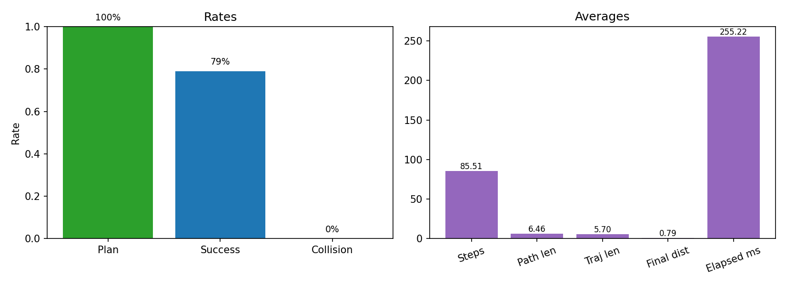

# Robot Navigation Portfolio Demo


This project is a minimal closed-loop 2D navigation demo:
- Grid map with obstacles
- A* path planning
- Pure Pursuit control on a unicycle model
- Matplotlib visualization (PNG, optional GIF)

## Demo


## Quick Start
```bash
python -m venv .venv
.venv/bin/pip install -e .
navsim-demo --start 0,0 --goal 9,9 --png output.png
```

Optional GIF:
```bash
navsim-demo --gif output.gif
```

Enable dynamic obstacles with replanning:
```bash
navsim-demo --dynamic
```

Enable EKF localization (shows estimated trajectory):
```bash
navsim-demo --localization
```

## Benchmark
Run a batch of random start/goal trials and write metrics to CSV:
```bash
navsim-benchmark --trials 50 --csv reports/benchmark.csv
```
Benchmark options include `--local-planner`, `--seed`, and `--config`.
See `docs/benchmark.md` for metric definitions.

## Benchmark Summary



## Dev Tooling
```bash
.venv/bin/pip install -e .[dev]
pre-commit install
```

## Parameters
```
--config path  Config file (default: configs/default.yaml)
--start x,y     Start grid cell
--goal x,y      Goal grid cell
--png path      Output PNG path (default: output.png)
--gif path      Optional GIF path
--inflation-radius  Obstacle inflation radius (grid units)
--local-planner     Local planner: pure_pursuit or dwa
--dynamic       Enable dynamic obstacles (uses DWA)
--no-dynamic    Disable dynamic obstacles
--replan-interval  Steps between replans (default from config)
--max-replans   Safety cap on replans (default from config)
--localization  Enable EKF localization
--no-localization  Disable EKF localization
--lookahead     Pure pursuit lookahead (default: 0.8)
--speed         Linear speed (default: 0.8)
```

## Design Notes
- **Grid map**: hard-coded demo map in `navsim/map.py`.
- **Planner**: 4-connected A* with Manhattan heuristic.
- **Local Planner**: DWA-lite (trajectory rollout + scoring).
- **Controller**: Pure Pursuit with unicycle kinematics.
- **Costmap**: obstacle inflation for a conservative planning footprint.
- **Dynamic obstacles**: moving obstacles + periodic replanning.
- **Localization**: EKF with noisy odometry + position measurements.
- **Visualization**: map, planned path, and executed trajectory.

Local planner parameters live in `configs/default.yaml` under `dwa`.

## Trade-offs
- Dynamic obstacles use a simple bounce model without perception.
- Localization relies on noisy position measurements (not map-based).
- Local planning is simplified DWA without full dynamics or smoothing.

## Tests
```bash
.venv/bin/pip install -e .[dev]
.venv/bin/ruff check .
.venv/bin/mypy navsim scripts tests
.venv/bin/pytest -q
```
