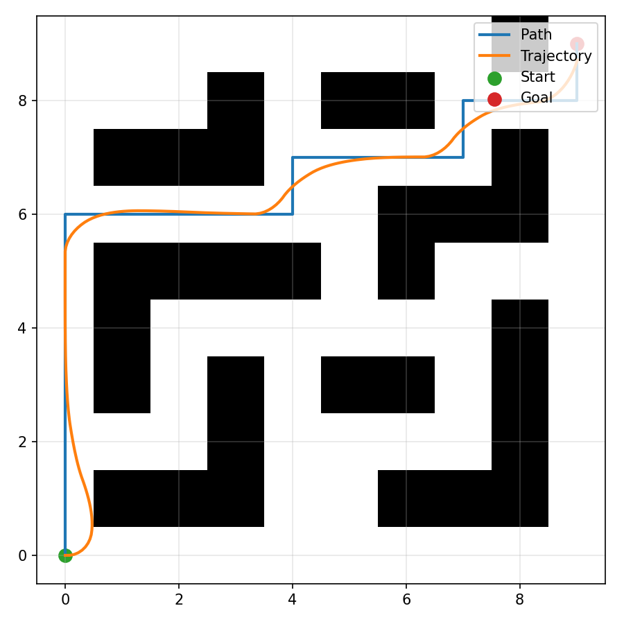

# Robot Navigation Portfolio Demo

This project is a minimal closed-loop 2D navigation demo:
- Grid map with obstacles
- A* path planning
- Pure Pursuit control on a unicycle model
- Matplotlib visualization (PNG, optional GIF)

## Demo



## Quick Start
```bash
python -m venv .venv
.venv/bin/pip install -e .
navsim-demo --start 0,0 --goal 9,9 --png output.png
```

Optional GIF:
```bash
navsim-demo --gif output.gif
```

## Parameters
```
--config path  Config file (default: configs/default.yaml)
--start x,y     Start grid cell
--goal x,y      Goal grid cell
--png path      Output PNG path (default: output.png)
--gif path      Optional GIF path
--inflation-radius  Obstacle inflation radius (grid units)
--lookahead     Pure pursuit lookahead (default: 0.8)
--speed         Linear speed (default: 0.8)
```

## Design Notes
- **Grid map**: hard-coded demo map in `navsim/map.py`.
- **Planner**: 4-connected A* with Manhattan heuristic.
- **Controller**: Pure Pursuit with unicycle kinematics.
- **Costmap**: obstacle inflation for a conservative planning footprint.
- **Visualization**: map, planned path, and executed trajectory.

## Trade-offs
- No dynamic obstacle handling or replanning.
- Control and planning are decoupled for clarity.
- Uses a simple grid and kinematics to keep the demo focused.

## Tests
```bash
pytest
```
